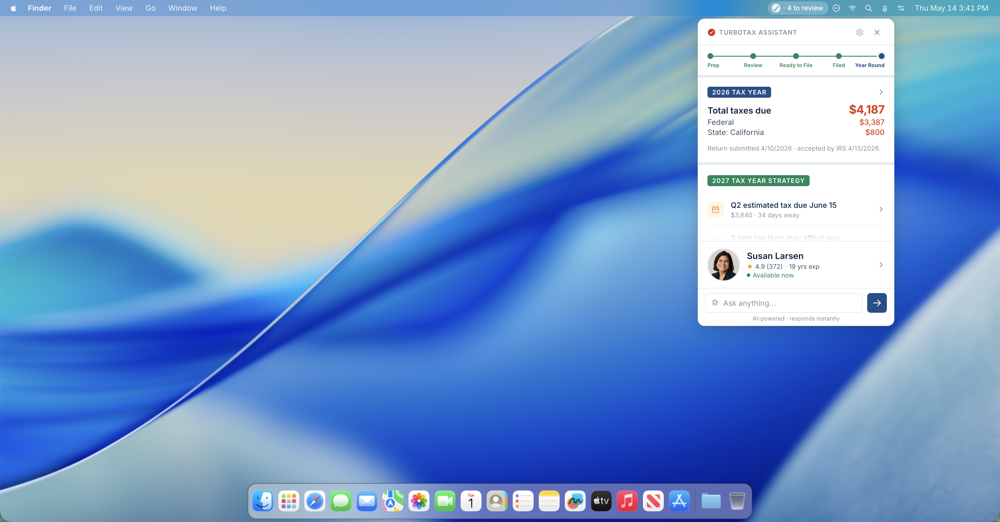

# TurboTax Business Tax Assistant
**Intuit × Anthropic Hackathon · May 2026 · Team Malumin**

## 🚀 Live Prototype — No installation required

| | Link |
|---|---|
| **Intuit GHE** | [github.intuit.com/pages/xlu02/TurboTax-Assistant/prototype/](https://github.intuit.com/pages/xlu02/TurboTax-Assistant/prototype/) |
| **Public** | [xiaoseanlu.github.io/3X-Hackathon/prototype/](https://xiaoseanlu.github.io/3X-Hackathon/prototype/) |

*Click the link, then click the TurboTax icon in the simulated menu bar.*




https://github.intuit.com/user-attachments/assets/07594f83-3fe3-425a-a302-6918d71b635a


---

## The Problem

TurboTax Business has staked its future on a promise: year-round, expert-centered service for small business owners. The problem is that we haven't built a product around customer behavior.

TurboTax and QuickBooks are opened a few times a year at most. Relationships don't accumulate that way. Trust doesn't either. What TurboTax Business is selling as a year-round relationship is being experienced by customers as a seasonal transaction — they log in when they have to, hand off their documents, and disappear. Their CPA goes dark between seasons.

The structural issue: the relationship requires frequent small moments, and our surfaces can't host them. No product at Intuit currently lives where the customer works.

Real customers, from our Hey Marvin research:

> *"We have a cursory call or sort of go over everything… and then they sort of go away by themselves, and then they come back when it's done."*
> — Keisha W., small business owner

> *"I had a really bad day last February. My accountant looked at me with a not-so-friendly face and asked if I had more deductions. I ended up owing more than I expected."*
> — Monika, yoga instructor / solopreneur

---

## The Strategy: Ambient Presence

> *"The solution isn't more presence, it's smarter presence. Persistent but invisible — running in the background, surfacing only when something actually matters. Event-driven, not weekly-cadence."* — Haley, Team Malumin

The Tax Assistant Widget is a macOS menu bar app. It lives in the top-right corner of the customer's screen — the same real estate as Slack, Dropbox, and their calendar. Always there. No login, no new tab, no context switch. A customer working in QuickBooks can glance up, see a notification badge, click, and handle a tax decision in 15 seconds without opening a browser.

This is not a mini version of TurboTax. It's a different kind of surface entirely: **ambient, glanceable, expert-anchored.** The product doesn't ask customers to do tax prep. It asks them to make small decisions at the moment they arise, with their expert already in the loop.

---

## Five Customer Problems — and How We Addressed Each One

These five problems are the core of the project. They came from the team's pre-hackathon alignment work and were the lens through which every feature decision was made.

### Presence
*Between filings, I have no sense that anyone is actually working on my tax situation. The rest of the time, it feels like I'm on my own.*

**How might we** make the expert continuously visible in the customer's workspace, so the relationship feels active even when nothing is happening?

Susan Larsen's card lives in the widget's sticky footer across every view. After the customer books their first meeting, Susan's name, availability, and upcoming meeting are always one glance away — not buried in a product they have to log into.

### Frequency
*When something comes up, I have to decide whether it's worth bothering my expert about. Most of the time I decide it isn't, and then I forget. By the time we talk, the small things have piled up.*

**How might we** create small moments between the expert and the customer often enough that trust and context accumulate, without overwhelming either side?

> *"If I had some kind of one-place repository that did everything… if that was automated, that'd be fantastic. It's just one less thing I'd have to do."*
> — Small business owner, Hey Marvin

The widget surfaces lightweight touch points — a notification badge, a quick document upload, an ask input — that lower the cost of reaching out to near zero. Each small interaction keeps the thread alive between the big ones.

### Reachability
*Reaching my expert means logging in, finding the right place, writing a message, and then waiting. The cost of asking is high enough that I save up my questions.*

**How might we** make the expert reachable from inside the customer's day, without requiring them to stop what they're doing?

The widget requires no login after setup. The "Ask" input is visible from every view. For anything requiring a real conversation, joining Susan's video call is a single tap the moment she's ready.

### Proactivity
*I make decisions that affect my taxes all the time — a purchase, a hire, a distribution — without realizing they affect my taxes. By the time my expert sees the consequences, the decision is already made.*

**How might we** surface tax-relevant moments to the customer as they happen, so decisions are made with expert input instead of regret?

The widget's main view surfaces year-round events as they become relevant: Q2 estimated tax due, new tax laws affecting S Corps, business changes that need categorization. These aren't reports — they're actionable cards at the moment of relevance, with a direct path to Susan or an approval flow.

### Trust
*Every time I do reach out, I have to re-explain my business, my year, what's changed. My expert is starting from scratch each time, which makes me feel like a ticket rather than a client.*

**How might we** eliminate the context-rebuild cost on both sides, so the customer doesn't hesitate to reach out and the expert can be useful the moment they engage?

> *"There is a value to having somebody who knows you. I click, and within a day or two, we have a meeting, we can talk about my business."*
> — Seth W., small business owner, Hey Marvin

Susan's profile in the widget shows her full history with the customer: every review, filing, payment, and planning session. When documents are uploaded or accounts connected, that context is available to Susan before the meeting starts.

---

## Why Expert-Anchored?

The team debated two directions: product-anchored (a lightweight action tool surfacing automated insights) vs. expert-anchored (a persistent CPA relationship manager). We landed on expert-anchored, and the logic matters.

The small business market has a confidence gap. These are owners who know their product deeply and their taxes shallowly. They aren't looking for better software — they're looking for someone they can trust to handle this. The widget doesn't just connect you to an expert. It makes the expert the felt center of the experience at every step.

Susan is the product's north star. Every design decision flows from that:
- The first thing the widget does is get you matched with Susan and schedule your first call.
- Your home screen shows Susan's status, your upcoming meeting, and what she's working on.
- The meeting notification doesn't say "your appointment is starting." It says "Susan is ready."
- Even the ask input becomes "Ask Susan" when you're inside her profile.

---

## What's Built

### The Widget Shell
A fully interactive macOS menu bar widget — a single self-contained HTML file (~5,500 lines, all CSS and JS inline). Runs as a live prototype in any browser via GitHub Pages, and as a real Electron menu bar app with a TurboTax icon in your actual macOS menu bar. Push/pop navigation with parallax transitions, scroll-fades into the expert footer, context-aware header and menu bar pill text.

### Year-Round Hub
The default state between tax seasons. Shows the customer's complete tax picture at a glance: last filed return, business health stats (revenue, expenses, estimated tax, refund projection), and a 2027 Tax Year Strategy section with upcoming deadlines and quick-tap action cards. The hub is what makes the experience feel continuous rather than seasonal.

### Quick-Tap Action Cards
Pending items — estimated payments, new tax law alerts, business change flags — surface as compact cards with the key number, deadline, and context. One tap dismisses after handling. The menu bar icon badge updates in real time as items are resolved.

### The Tax Review Arc
A complete review workflow spanning three linked views: **Tax Review Hub** (pending approvals, financial summary, recent activity), **Deductions Detail** (full breakdown by category with individual line items), and **Activity Timeline** (chronological log of everything reviewed, approved, or flagged).

### The Filing Arc
**Ready to File** shows the expert-approved package: green-checkmark hero, refund amount, forms included, and a link to schedule a final review with Susan. Filing advances to **Filed** — a success screen with a live refund tracker (Filed → Processing → Approved → Deposited) and a "Continue to tax planning" CTA that returns to the year-round hub.

### Five-Step Global Progress Stepper
Persistent across all active tax season views: Prep → Review → Ready to File → Filed → Year Round. Every dot is clickable and navigates directly to that stage.

### Susan Larsen — Your Dedicated Expert
Her profile shows credentials, a stage-aware activity timeline that grows as the engagement deepens, and a booking sheet for scheduling a call or video chat with date and time selection. Post-booking, Susan's status updates across every view.

### Expert Matching
For unmatched customers, the **Expert List** lets them browse matched CPAs by specialty, rating, and availability before committing to a match.

### Connected Accounts (QuickBooks Data Sync)
Every linked financial institution and app shown in a fully-connected state — Chase, Mercury, Stripe, QuickBooks — with a transaction analysis feed. Tapping any institution surfaces balances and a document list of what's been automatically pulled and categorized.

### Document Upload
Drag-and-drop upload for tax documents not automatically synced. After upload, a categorized review screen shows the file and Susan's review status — designed to feel like sending something to an expert, not filing in a folder.

### Tax Calendar
A full-year calendar by quarter with event descriptions and days-remaining countdowns. Every calendar entry connects to a Susan touch point.

### AI Chat
Context-aware ask input pinned to every view. Switches from AI icon to Susan's photo when inside her profile. Smart demo mode with pre-scripted responses demonstrating real tax advisory scenarios.

### Settings + Demo Controls
Account info, company profile, notification preferences, connected accounts — plus a full demo control panel for jumping to any stage or view.

---

## Design Principles

**Flat and dense, not light and airy.** Small business owners are busy. They need information density and clear hierarchy. Every pixel earns its place.

**Progressive disclosure over feature listing.** The home screen shows almost nothing on first login. As the customer completes each stage — booking, uploading, meeting — new cards and paths appear. Complexity reveals itself only as it becomes relevant.

**State over settings.** Nothing asks customers to configure the widget. Everything adapts to where they are in the journey. The stepper advances automatically. Susan's footer appears after booking. The "Join Meeting" card appears when she's ready.

**Context-aware AI, not generic AI.** The ask input knows what view the customer is on. The product doesn't pretend the AI and the expert are the same thing.

**The expert is always reachable.** Susan's footer card is persistent across every view. No matter where you navigate, you're one tap away from your CPA. That's the felt promise of year-round service.

---

## The Bigger Bet

> From a seasonal transaction to a trusted relationship. The expert your customers pay for, finally present in the moments that matter.

Customers won't change how they work. They won't remember to open TurboTax in July. But they will notice a notification badge when they're already at their computer. They will tap a "Join meeting" card when their CPA is ready. They will upload a W-2 by dropping it into a widget they can see right now.

The widget doesn't change the customer's workflow. It inserts itself into the gaps between everything else they're doing — which is exactly where a year-round relationship needs to live.

---

## Getting Started

### Option A — Live link (zero setup) ⭐ Fastest

- **Intuit GHE:** [→ Open the live prototype](https://github.intuit.com/pages/xlu02/TurboTax-Assistant/prototype/)
- **Public:** [→ Open the live prototype](https://xiaoseanlu.github.io/3X-Hackathon/prototype/)

Click the TurboTax icon in the simulated macOS menu bar to open the widget. No cloning, no installs, works in any browser.

### Option B — Run as a real macOS menu bar app

**Prerequisite:** Node.js 18+ — [download here](https://nodejs.org) if you don't have it.

1. Clone the repo
2. Double-click **`Launch Widget.command`** in Finder

> **⚠️ First-run security warning:** Right-click `Launch Widget.command` → **Open** → **Open** again. You won't see this warning after the first time.

### Option C — Run from terminal

```bash
cd electron-app
npm install          # first time only
npm start
```

---

## Demo Flow

1. Open widget → year-round hub (QB stats, 2027 strategy, Susan card)
2. Demo Controls → Tax Review Hub → pending approval items
3. Tap Deductions → full breakdown by category
4. Tap Ready to File in stepper → filing screen with forms list
5. Tap File Federal & State Return → success screen + refund tracker
6. Tap Continue to tax planning → back to year-round hub
7. Tap Susan's footer card → expert profile with full activity timeline

---

## Folder Structure

```
TurboTax-Assistant/
├── README.md
├── AI_INSTRUCTIONS.md               ← Read before starting a Claude session
├── CHANGELOG.md
├── Launch Widget.command
├── prototype/
│   ├── index.html                   ← The widget (~5,500 lines, fully self-contained)
│   └── design-system/
│       ├── Component Gallery.html
│       ├── Component Inventory.md   ← Design token + component spec source of truth
│       └── Product Design Requirements.md
├── electron-app/
│   ├── main.js
│   ├── preload.js
│   └── package.json
└── documents/
    ├── Product & Design Strategy.md
    └── Demo Script + Elevator Pitch.md
```

---

## Team

| Role | Person |
|------|--------|
| XD | Sean Lu |
| XD | Haley Malucchi |
| PM | Armin Naghashzadeh |

*Design → Sean or Haley · Product → Armin*

*Built during the Intuit × Anthropic Hackathon, May 12–14, 2026*
